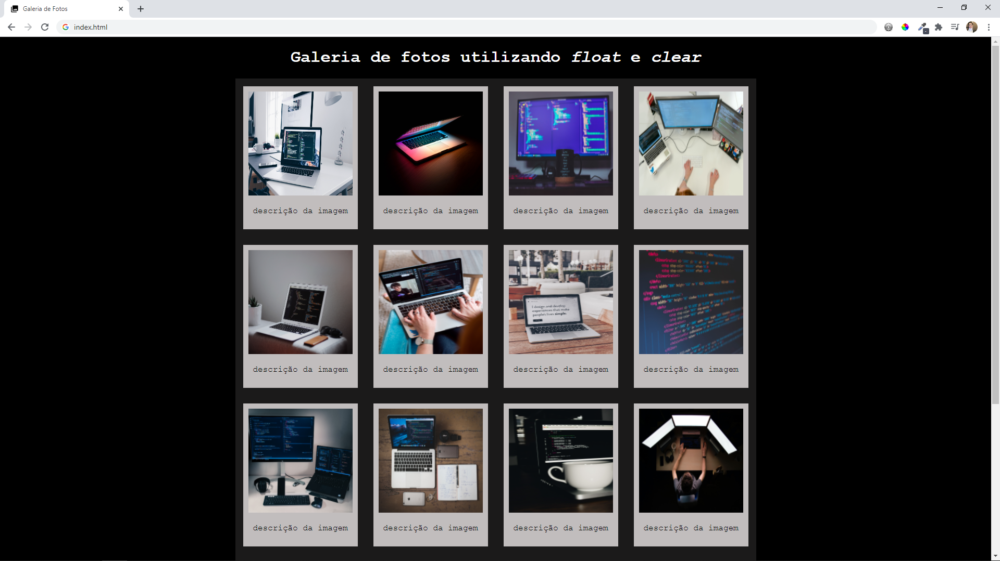
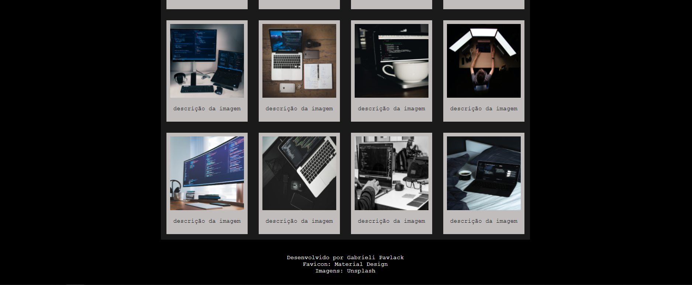
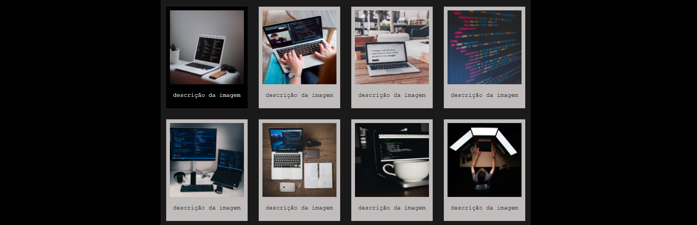

# Galeria de Fotos
Este projeto consiste na criação de uma simples galeria de fotos para treinar os conceitos das propriedades de CSS <b>float</b> e <b>clear</b>.

<h2>A Galeria:</h2>

<h2>Propriedade hover:</h2>
Ao passar a seta do <i>mouse</i> em alguma imagem, a mesma ficará com fundo preto e letras brancas.
  

<h2>  TECNOLOGIAS</h2>

HTML5  
CSS3

<h2>  FERRAMENTAS</h2>
Visual Studio Code  
Imagens: https://unsplash.com/  
Favicon: https://material.io/resources/icons
